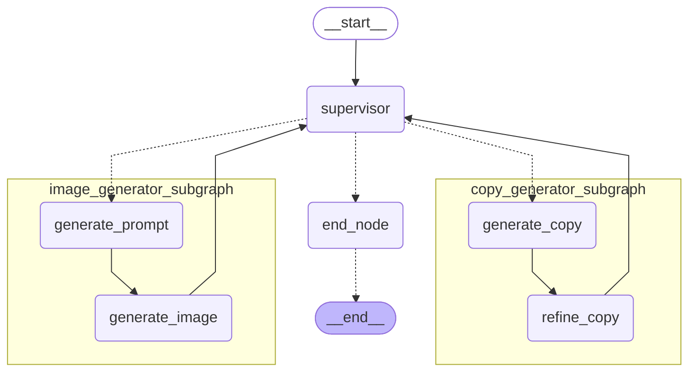

# Streamlit × LangGraph Supervisor型マルチエージェント 広告素材生成アプリケーション

本レポジトリでは、StreamlitとLangGraphを用いた、Supervisor型マルチエージェントによる簡易的な広告素材生成アプリのサンプルコードを公開している。

[](./images/demo_movie.gif)

## 特徴
- **LangGraphによるMulti-Agentの実装**: LangGraphを用いて、Supervisor型マルチエージェントを実装している。
- **StreamlitによるWebアプリケーション化**: Streamlitを用いて、Webアプリケーション化している。

## 使い方
### 1. リポジトリのクローン
```bash
https://github.com/yamato0811/streamlit-langgraph-multi-agent.git
cd streamlit-langgraph-multi-agent
```

### 2. 仮想環境の作成（推奨）
```bash
python -m venv .venv
source .venv/bin/activate
```

### 3. ライブラリのインストール
```bash
pip install -r requirements.txt
```

### 4. Bedrockの設定
オレゴンリージョンでのモデル（Claude 3.7 Sonnet or Claude 3.5 haiku）の有効化と、IAMアクセスキーの発行およびAWS CLIの設定が必要である。  
（EC2上で実行する場合は必要なポリシーをアタッチすればよい。）

### 5. Streamlitアプリの起動
`src`ディレクトリに移動し、以下のコマンドを実行する。
```bash
cd src
streamlit run app.py
```

ブラウザでアプリが起動し、アプリを利用できる。

## アプリの概要
### LangGraphのグラフ構造
以下は、本アプリのグラフ構造である。


### アプリの機能
Supervisorは以下2つの機能を持つエージェントを管理しており、ユーザーからの要望に応じて各エージェントに指示を出す。

- **コピー文生成エージェント**: キーワードに基づいて、コピー文を生成する。
  - Supervisorにコピー生成を要望すると、Copy Generatorエージェントがコピー文を生成する。
  - Copy Generatorエージェントは、一度コピーを生成したあとコピー文を自身で改善する。
- **画像生成エージェント**: 画像の主題（ビジュアルコンセプト）に基づいて、画像を生成する。
  - Supervisorに画像生成を要望すると、Image Generatorエージェントが画像生成用プロンプトを作成する。
  - Image Generatorエージェントは、作成したプロンプトを元に画像を生成する。

## ディレクトリ構成
`src`ディレクトリ配下の主要なディレクトリ構成は以下の通りである。
```
src                          
├── agent                    
│   ├── copy_generator.py    # コピー生成エージェント
│   ├── image_generator.py   # 画像生成エージェント
│   ├── state.py             # エージェントの状態管理
│   ├── supervisor.py        # Supervisorエージェント
│   └── tools.py             # Supervisorエージェントが使用するツール
├── app.py                   # アプリのメインロジック
├── models                   
│   ├── bedrock_img_gen_model.py  # 画像生成モデル（Bedrock）
│   └── llm.py               # LLMモデル定義
└── utils                    
    ├── app_util.py          # Streamlit用ユーティリティ関数
    └── img_util.py          # 画像処理ユーティリティ関数
```
