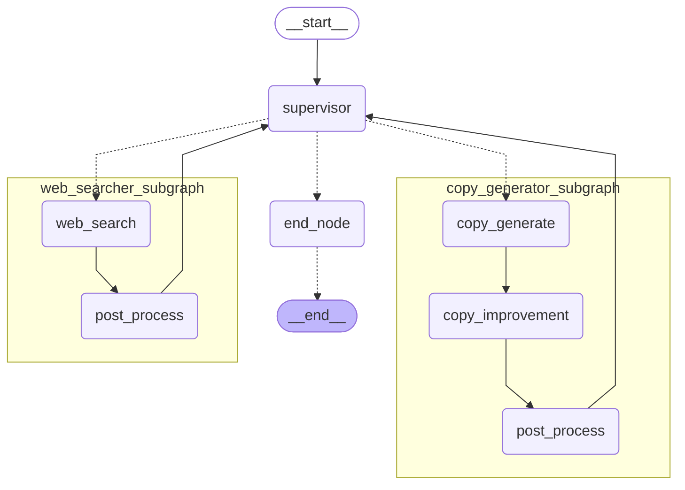

# Streamlit × LangGraph Supervisor型マルチエージェント 広告コピー文生成アプリケーション

本レポジトリでは、StreamlitとLangGraphを用いた、Supervisor型マルチエージェントによる簡易的な広告コピー文生成アプリのサンプルコードを公開している。

[](./images/demo_movie.gif)

## 特徴
- **LangGraphによるMulti-Agentの実装**: LangGraphを用いて、Supervisor型マルチエージェントを実装している。
- **StreamlitによるWebアプリケーション化**: Streamlitを用いて、Webアプリケーション化している。

## 使い方
### 1. リポジトリのクローン
```bash
https://github.com/yamato0811/streamlit-langgraph-multi-agent.git
cd streamlit-langgraph-multi-agent
```

### 2. 仮想環境の作成（推奨）
```bash
python -m venv .venv
source .venv/bin/activate
```

### 3. ライブラリのインストール
```bash
pip install -r requirements.txt
```

### 4. 環境変数の設定
#### Gemini利用の場合
1. サービスアカウントキーを取得  
「Vertex AI 管理者」の権限を持つ[サービスアカウントキーを取得](https://cloud.google.com/iam/docs/keys-create-delete?hl=ja#creating)し、`vertexai-credentials.json` という名前で`.env`と同じディレクトリに配置する。
2. `.env.example` をコピーして `.env` を作成する。`GOOGLE_APPLICATION_CREDENTIALS=./vertexai-credentials.json`部分はそのままで良い。
```bash
cp .env.example .env
```

### 5. Streamlitアプリの起動
`src`ディレクトリに移動し、以下のコマンドを実行する。
```bash
cd src
streamlit run app.py
```

ブラウザでアプリが起動し、アプリを利用できる。

## アプリの概要
### LangGraphのグラフ構造
以下は、本アプリのグラフ構造である。


### アプリの機能
Supervisorは以下2つの機能を持つエージェントを管理しており、ユーザーからの要望に応じて各エージェントに指示を出す。

1. **Web検索エージェント**: ユーザが入力したキーワードに基づいて、Web検索を行う。
    - SupervisorにWeb検索を要望すると、Web SearcherエージェントがWeb検索を行う。
2. **コピー文生成エージェント**: ユーザが入力したキーワードに基づいて、コピー文を生成する。
    - Supervisorにコピー生成を要望すると、Copy Generatorエージェントがコピー文を生成する。
    - Copy Generatorエージェントは、一度コピーを生成したあとコピー文を自身で改善する。

## ディレクトリ構成
`src`ディレクトリ配下の主要なディレクトリ構成は以下の通りである。
```
src                          
├── agent                    
│   ├── copy_generator.py    # コピー生成エージェント
│   ├── state.py             # エージェントの状態管理
│   ├── supervisor.py        # Supervisorエージェント
│   ├── tools.py             # Supervisorエージェントが使用するツール
│   └── web_searcher.py      # Web検索エージェント
├── app.py                   # Streamlitアプリのメインロジック
├── models                   
│   ├── grounding_llm.py     # グラウンディングLLM定義(Gemini)
│   └── llm.py               # LLMモデル定義
└── utils                    
    └── app_util.py          # Streamlitユーティリティ関数
```

## その他
- `graph.md` は、LangGraphのグラフ構造をMermaid形式で記述したもの。Mermaid対応のエディタやツールで開くことで、グラフを視覚的に確認できる。