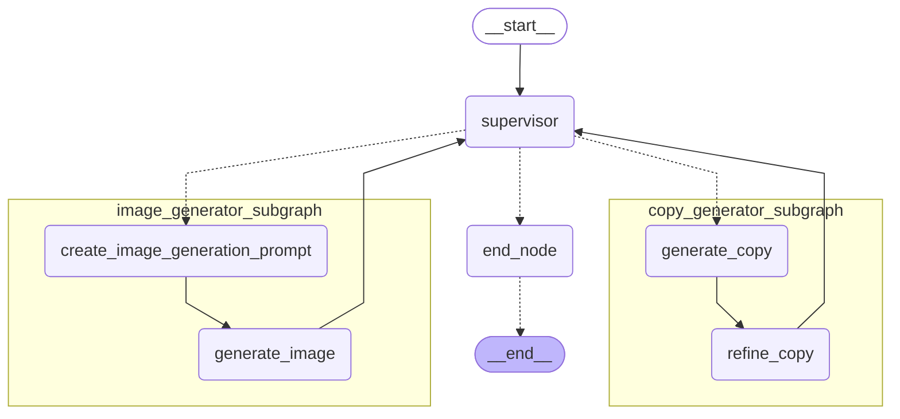

```mermaid
%%{init: {'flowchart': {'curve': 'linear'}}}%%
graph TD;
	__start__([<p>__start__</p>]):::first
	supervisor(supervisor)
	copy_generator_subgraph_generate_copy(generate_copy)
	copy_generator_subgraph_refine_copy(refine_copy)
	image_generator_subgraph_create_image_generation_prompt(create_image_generation_prompt)
	image_generator_subgraph_generate_image(generate_image)
	end_node(end_node)
	__end__([<p>__end__</p>]):::last
	__start__ --> supervisor;
	copy_generator_subgraph_refine_copy --> supervisor;
	image_generator_subgraph_generate_image --> supervisor;
	supervisor -.-> copy_generator_subgraph_generate_copy;
	supervisor -.-> image_generator_subgraph_create_image_generation_prompt;
	supervisor -.-> end_node;
	end_node -.-> __end__;
	subgraph copy_generator_subgraph
	copy_generator_subgraph_generate_copy --> copy_generator_subgraph_refine_copy;
	end
	subgraph image_generator_subgraph
	image_generator_subgraph_create_image_generation_prompt --> image_generator_subgraph_generate_image;
	end
	classDef default fill:#f2f0ff,line-height:1.2
	classDef first fill-opacity:0
	classDef last fill:#bfb6fc
```